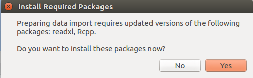

```{r setup, include=FALSE}
knitr::opts_chunk$set(echo = TRUE)
```

# Built-in functions for exploring a data frame
We will use built-in dataset `iris` to explore some of the useful functions in  `base` package of R language. In order to know the dimensions of `iris`, we use `dim` function. The output of `dim` function is a vector, in which the elements represent the number of rows and number of columns, respectively. 
```{r echo=TRUE}
dim(iris)
```

We can also use `nrow` and `ncol` to get the number of rows and number of columns, respectively.  
```{r echo=TRUE}
nrow(iris)
ncol(iris) 
```
Thus, `iris` has 150 rows and 2 columns, which can also be verified by using `str` function. It also returns many useful pieces of information, including the above information and the types of data for each column. 

```{r echo=TRUE}
str(iris)
```

The first row in the output indicates that this dataset is a data frame with 150 observations of 5 variables. Also, `num` denotes that the variables `Sepal.Length`, `Sepal.Width`, `Petal.Length` and `Petal.Width` are numeric. `Factor` denotes that the variable `Species` is categorical with 3  levels (`setosa`, `versicolor`, `virginica`).  

To know the range of values inside `iris`, we use `summary` function. In particular, this function provides a number of useful statistics including range, median and mean [@EDA]. 
```{r echo=TRUE}
summary(iris)
```

We use `head` to obtain the first `n` observations and `tail` to obtain the last `n` observations; by default, `n` = 6.  These are good commands for obtaining an intuitive idea of what the data look like without revealing the entire dataset, which could have millions of rows and thousands of columns [@Eric]. 
```{r echo=TRUE}
head(iris, 2)
tail(iris, 2)
```

# Dependencies for reading datasets in R 

In order to read `XML` files in R, we need to install `XML` package. However, the Ubuntu package `libxml2-dev` needs to be installed beforehand [@Stack]. On Linux operating system, open the terminal and type the following commands. 

`sudo apt-get update`

`sudo apt-get install libxml2-dev`

Similarly, while importing Excel data in R, we need to install `readxl` and `Rcpp`. If these packages are not installed and you try importing Excel data, a pop-up message as shown in Figure 1 will be generated. By clicking **Yes** to this message, these packages can be installed.


```{r, fig.align="center", echo=FALSE, fig.cap="Installing readxl and Rcpp", out.width = '75%'}

```

# References 
